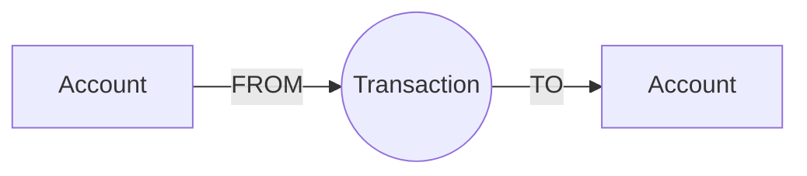
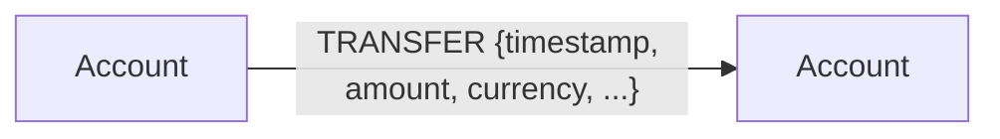

# Finance repository

## Graph modeling: bipartite vs monopartite

### Bipartite (Accounts + Transactions as nodes)

In a bipartite model, `Account` and `Transaction` are two distinct node types. Each transaction links to the source and destination accounts.

Typical characteristics:
- Transaction attributes live on the `Transaction` node (timestamp, amount, currency, flags, etc.).
- Easy to attach extra relationships to a transaction (e.g., `(:Pattern)-[:CONTAINS]->(:Transaction)` or `(:Alert)-[:REFERSTO]->(:Transaction)`).

### Monopartite (Accounts only; Transactions as relationships)

In a monopartite model, the graph is primarily composed of `Account` nodes. A “transaction” is represented as a relationship between accounts, typically carrying the transaction properties.

Typical characteristics:
- Fewer nodes; traversals like “who paid whom” can be direct.
- Harder to represent multi-leg transactions or attach many independent links to the same transaction without turning it back into a node.
- Can be use when all transactions between 2 accounts are merged into 1 single relationship

## How to 

1. Follow instructions for [ingestion](./ingestion/readme.md)